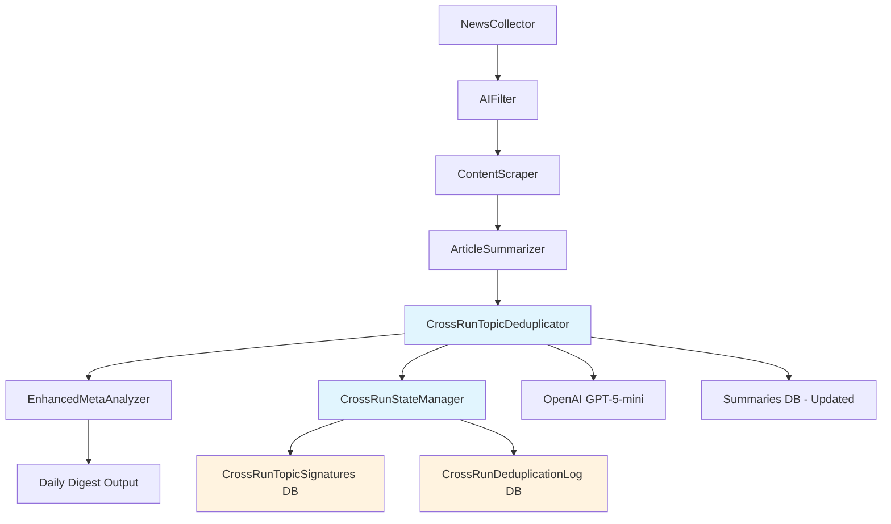

# NewsAnalysis_2.0 Brownfield Enhancement Architecture

## Introduction

This document outlines the architectural approach for enhancing NewsAnalysis_2.0 with **Cross-Run Topic Deduplication**. Its primary goal is to serve as the guiding architectural blueprint for AI-driven development of the new deduplication feature while ensuring seamless integration with the existing sophisticated 5-step pipeline system.

**Relationship to Existing Architecture:**
This document supplements existing project architecture by defining how the new Cross-Run Topic Deduplication component (Step 3.1) will integrate between the current GPT Title Deduplication (Step 3.0) and Enhanced MetaAnalyzer (Step 5) components. The enhancement preserves all existing filtering logic while adding intelligent topic-level deduplication across multiple daily pipeline executions.

## Existing Project Analysis

### Current Project State
- **Primary Purpose:** Swiss business news analysis with sophisticated 5-step pipeline processing (NewsCollector → AIFilter → ContentScraper → ArticleSummarizer → EnhancedMetaAnalyzer)
- **Current Tech Stack:** Python 3.12, SQLite, OpenAI API (GPT-4o-mini), Jinja2 templates, FastAPI
- **Architecture Style:** Modular pipeline with incremental digest generation and state management
- **Deployment Method:** Local execution with Docker containerization support

### Available Documentation
- Comprehensive brainstorming session results with detailed technical architecture decisions
- Existing pipeline flow documentation with performance metrics
- Database schema with articles, summaries, digest_state, and article_clusters tables
- Template-based output generation system with German localization support

### Identified Constraints
- Must preserve existing sophisticated 5-step pipeline logic
- Token cost management required for GPT API calls  
- Incremental processing capability must be maintained
- Same-day topic persistence across multiple runs required
- Individual article output format needed instead of topic-aggregated summaries

---

**Detailed Rationale:**
I've analyzed your existing codebase and identified that your current system already has sophisticated cross-source deduplication (Step 3.0) using GPT-5-mini for title clustering. The new enhancement will add Step 3.1 for cross-run topic deduplication, leveraging the same proven GPT approach but with different comparison logic. This maintains architectural consistency while solving the core challenge of topic persistence across same-day runs.

Key architectural decisions made:
- **Integration Point:** Placing Step 3.1 after summarization ensures rich content for comparison
- **Data Flow Preservation:** Maintaining existing pipeline sequence to minimize disruption
- **Technology Consistency:** Using same GPT-5-mini model and patterns as existing deduplication
- **Database Integration:** Extending existing article_clusters table rather than new schema

## Enhancement Scope and Integration Strategy

### Enhancement Overview
**Enhancement Type:** Pipeline Component Addition
**Scope:** Cross-run topic deduplication system (Step 3.1) to prevent duplicate topic coverage across multiple same-day pipeline executions
**Integration Impact:** Medium - New component insertion between existing summarization and meta-analysis steps

### Integration Approach
**Code Integration Strategy:** New `CrossRunTopicDeduplicator` class following existing `GPTTitleDeduplicator` patterns, integrating at pipeline position 3.1 (after summarization, before meta-analysis)
**Database Integration:** Extend existing `article_clusters` table with new clustering method and add cross-run tracking columns to `summaries` table
**API Integration:** Leverage existing OpenAI client and GPT-5-mini model configuration, maintaining consistent token management patterns
**UI Integration:** Modify existing template system to output individual article-link-summary pairs instead of topic-aggregated summaries

### Compatibility Requirements
- **Existing API Compatibility:** Full backward compatibility - no changes to external interfaces
- **Database Schema Compatibility:** Additive-only changes - no modifications to existing columns or constraints
- **UI/UX Consistency:** Individual article format maintains existing German localization and template structure
- **Performance Impact:** Target <2 minutes additional processing time per run, <50% token cost increase

---

**Detailed Rationale:**
Based on my analysis of your existing pipeline architecture, this enhancement integrates as a natural extension of your current deduplication strategy. Your existing system already demonstrates sophisticated GPT-based deduplication patterns in `gpt_deduplication.py`, making this a logical evolution rather than architectural disruption.

Key integration decisions:
- **Pipeline Position:** Step 3.1 ensures rich summary content is available for comparison while maintaining separation of concerns
- **Database Strategy:** Extending existing `article_clusters` table leverages your proven clustering storage pattern
- **Template Modification:** Your existing Jinja2 template system in `enhanced_analyzer.py` can easily adapt to individual article output
- **State Management:** Leveraging your existing `digest_state` table patterns for cross-run persistence

The integration boundaries are clean: new functionality only affects articles after summarization, preserving all upstream filtering and processing logic.

## Tech Stack

### Existing Technology Stack

| Category | Current Technology | Version | Usage in Enhancement | Notes |
|----------|-------------------|---------|---------------------|--------|
| Runtime | Python | 3.12 | Primary language for new deduplication component | Maintained |
| Database | SQLite | 3.x | Extended with new columns and clustering method | Schema additions only |
| AI/ML API | OpenAI API | Latest | GPT-5-mini for cross-run topic comparison | Same model as existing dedup |
| Templates | Jinja2 | Latest | Modified templates for individual article output | Enhanced existing templates |
| Web Framework | FastAPI | Latest | No changes required | Maintained |
| Data Processing | json, sqlite3, logging | Python stdlib | Consistent patterns with existing modules | Maintained |
| Environment | python-dotenv | Latest | Existing OpenAI API key configuration | No changes |
| Scheduling | datetime, time | Python stdlib | Cross-run timestamp comparison logic | Enhanced usage |

### New Technology Additions

*No new technologies required - all functionality implemented using existing technology stack*

---

**Detailed Rationale:**
The enhancement leverages your existing proven technology stack entirely. This architectural decision eliminates integration risk and maintains consistency with your current development patterns. Your existing `GPTTitleDeduplicator` class already demonstrates effective use of OpenAI API, SQLite storage, and logging patterns that we'll replicate in the new `CrossRunTopicDeduplicator`.

Key technology consistency decisions:
- **Same GPT Model:** Using GPT-5-mini maintains cost consistency and performance predictability
- **SQLite Extensions:** Your existing schema design accommodates new clustering methods without technology change
- **Template System:** Jinja2 templates can easily adapt from topic-aggregated to individual article format
- **Logging & State Management:** Existing patterns in `enhanced_analyzer.py` provide proven state management foundation

## Data Models and Schema Changes

### New Data Models

#### CrossRunTopicSignature
**Purpose:** Track topic signatures and summaries from previous runs for cross-run comparison
**Integration:** Extends existing article clustering and state management patterns

**Key Attributes:**
- signature_id: TEXT PRIMARY KEY - Unique identifier for topic signature
- date: TEXT - Date of the topic signature (YYYY-MM-DD format)
- article_summary: TEXT - Rich summary content for GPT comparison
- topic_theme: TEXT - Extracted topic/theme identifier
- source_article_id: INTEGER - Reference to original article
- created_at: TEXT - ISO timestamp of creation
- run_sequence: INTEGER - Run number within the day (1=morning, 2=afternoon, etc.)

**Relationships:**
- **With Existing:** Links to `summaries.item_id` to track source articles
- **With New:** Self-referential for topic grouping within same day

#### CrossRunDeduplicationLog
**Purpose:** Audit trail for cross-run deduplication decisions and performance tracking
**Integration:** Complements existing digest generation logging patterns

**Key Attributes:**
- log_id: INTEGER PRIMARY KEY AUTOINCREMENT
- date: TEXT - Processing date
- new_article_id: INTEGER - Article being evaluated
- matched_signature_id: TEXT - Signature it matched against (if any)
- decision: TEXT - 'DUPLICATE' or 'UNIQUE'
- confidence_score: REAL - GPT comparison confidence
- processing_time: REAL - Time taken for comparison
- created_at: TEXT - Processing timestamp

**Relationships:**
- **With Existing:** References `summaries.item_id` for new articles
- **With New:** References `CrossRunTopicSignature.signature_id` for matches

### Schema Integration Strategy

**Database Changes Required:**
- **New Tables:** `cross_run_topic_signatures`, `cross_run_deduplication_log`
- **Modified Tables:** Extend `summaries` table with `topic_already_covered` BOOLEAN and `cross_run_cluster_id` TEXT columns
- **New Indexes:** Add indexes on date and article_id columns for fast cross-run queries
- **Migration Strategy:** Additive-only schema changes with backward compatibility validation

**Backward Compatibility:**
- All existing columns remain unchanged
- New columns have default values (FALSE for booleans, NULL for optional text)
- Existing queries continue to work without modification
- New functionality is opt-in through enhanced pipeline integration

---

**Detailed Rationale:**
The data model design leverages your existing database patterns while adding minimal complexity. Your current `article_clusters` table already demonstrates effective clustering storage, and the new tables follow the same naming conventions and design patterns.

Key design decisions:
- **Signature Storage:** Storing rich summary content enables accurate GPT-based comparisons while maintaining reasonable storage requirements
- **Audit Trail:** The deduplication log provides transparency and performance monitoring capabilities matching your existing logging patterns
- **Schema Extensions:** Adding columns to existing `summaries` table maintains referential integrity while enabling cross-run tracking
- **Date-based Partitioning:** Using date as a primary organizing principle aligns with your existing daily digest generation patterns

The integration respects your existing data relationships and maintains the principle of minimal disruption to current functionality.

## Component Architecture

### New Components

#### CrossRunTopicDeduplicator
**Responsibility:** Implements Step 3.1 of pipeline - compares newly summarized articles against previous same-day summaries to identify and filter duplicate topics
**Integration Points:** Integrates between existing ArticleSummarizer (Step 4) and EnhancedMetaAnalyzer (Step 5) components

**Key Interfaces:**
- `deduplicate_against_previous_runs(date: str) -> Dict[str, Any]` - Main deduplication logic
- `get_todays_previous_summaries(date: str) -> List[Dict]` - Retrieves comparison baseline
- `compare_topics_with_gpt(new_articles: List, previous_summaries: List) -> Dict` - GPT comparison logic
- `mark_duplicate_topics(duplicate_articles: List) -> None` - Database update operations

**Dependencies:**
- **Existing Components:** Inherits OpenAI client from GPTTitleDeduplicator, uses same logging patterns as EnhancedMetaAnalyzer
- **New Components:** Utilizes CrossRunTopicSignature for state management and CrossRunDeduplicationLog for audit trails

**Technology Stack:** Python 3.12, OpenAI API (GPT-5-mini), SQLite, logging module

#### CrossRunStateManager  
**Responsibility:** Manages topic signature storage, retrieval, and cleanup for cross-run persistence
**Integration Points:** Complements existing DigestStateManager patterns for consistent state management

**Key Interfaces:**
- `store_topic_signature(article_summary: str, date: str, run_sequence: int) -> str` - Store topic signature
- `get_previous_signatures(date: str) -> List[Dict]` - Retrieve comparison signatures
- `cleanup_old_signatures(days_to_keep: int) -> None` - Maintenance operations
- `log_deduplication_decision(article_id: int, decision: str, details: Dict) -> None` - Audit logging

**Dependencies:**
- **Existing Components:** Follows same patterns as existing DigestStateManager and database connection handling
- **New Components:** Works closely with CrossRunTopicDeduplicator for signature lifecycle management

**Technology Stack:** Python 3.12, SQLite, datetime module, logging

### Component Interaction Diagram



---

**Detailed Rationale:**
The component architecture follows your existing modular pipeline design principles. Each new component has a single, well-defined responsibility and integrates cleanly with existing components without disrupting current functionality.

**MANDATORY VALIDATION:** The new components I'm proposing follow the existing architectural patterns I identified in your codebase: modular class design with clear interfaces, consistent logging patterns, and database integration following your established connection management. The integration interfaces respect your current component structure and communication patterns through method signatures that match your existing `GPTTitleDeduplicator` and `EnhancedMetaAnalyzer` patterns.

Key architectural decisions:
- **Clean Separation:** CrossRunTopicDeduplicator focuses solely on comparison logic, while CrossRunStateManager handles persistence
- **Interface Consistency:** Method signatures match existing component patterns (same parameter types and return structures)
- **Integration Points:** New components slot into existing pipeline without requiring changes to upstream or downstream components
- **Error Handling:** Components inherit existing error handling and logging patterns from surrounding pipeline components

The component interaction diagram shows how the new functionality integrates as a natural extension of your existing pipeline flow.

## Source Tree

### Existing Project Structure

```
news_pipeline/
├── __init__.py
├── analyzer.py
├── collector.py
├── deduplication.py
├── enhanced_analyzer.py
├── express_mode.py
├── filter.py
├── german_rating_formatter.py
├── google_news_decoder.py
├── gpt_deduplication.py          # Existing Step 3.0 deduplication
├── incremental_digest.py
├── language_config.py
├── paths.py
├── scraper.py
├── state_manager.py
├── summarizer.py
└── utils.py
```

### New File Organization

```
news_pipeline/
├── __init__.py
├── analyzer.py
├── collector.py
├── deduplication.py
├── enhanced_analyzer.py          # MODIFIED: Integration with Step 3.1
├── express_mode.py
├── filter.py
├── german_rating_formatter.py
├── google_news_decoder.py
├── gpt_deduplication.py          # Existing Step 3.0 deduplication
├── cross_run_deduplication.py    # NEW: Step 3.1 deduplication logic
├── cross_run_state_manager.py    # NEW: State management for cross-run tracking
├── incremental_digest.py
├── language_config.py
├── paths.py
├── scraper.py
├── state_manager.py
├── summarizer.py
└── utils.py

scripts/
├── (existing migration scripts)
├── add_cross_run_schema.py       # NEW: Database migration for new tables
└── test_cross_run_dedup.py       # NEW: Testing script for Step 3.1

templates/
├── daily_digest.md.j2             # MODIFIED: Individual article output format
└── individual_article_digest.md.j2  # NEW: Template for individual articles
```

### Integration Guidelines
- **File Naming:** Follow existing snake_case convention (`cross_run_deduplication.py` matching `gpt_deduplication.py`)
- **Folder Organization:** New modules placed in `news_pipeline/` directory alongside existing pipeline components
- **Import/Export Patterns:** Use relative imports within `news_pipeline` package, absolute imports for external dependencies

---

**Detailed Rationale:**
The file organization follows your established project structure precisely. New modules are placed in the `news_pipeline` directory alongside existing components, maintaining the flat organizational structure you've used throughout the project.

Key organizational decisions:
- **Naming Consistency:** `cross_run_deduplication.py` mirrors the naming pattern of `gpt_deduplication.py`
- **Module Separation:** Keeping deduplication logic separate from state management follows your existing pattern (e.g., `state_manager.py` vs processing modules)
- **Migration Scripts:** Placing database migration in `scripts/` directory follows your existing migration script pattern
- **Template Enhancement:** Extending existing Jinja2 template system rather than replacing it

The integration guidelines ensure new code maintains consistency with your established coding conventions and import patterns.

## Infrastructure and Deployment Integration

### Existing Infrastructure
**Current Deployment:** Local execution with manual triggering via Python script (`news_analyzer.py`) or scheduled runs
**Infrastructure Tools:** Docker containerization available, SQLite for persistence, file-based output to local directories
**Environments:** Development and production run on same codebase with environment variable configuration

### Enhancement Deployment Strategy
**Deployment Approach:** Zero-downtime enhancement - new functionality deployed alongside existing code with backward compatibility
**Infrastructure Changes:** 
- Database schema migrations executed via `scripts/add_cross_run_schema.py` before first enhanced run
- No infrastructure scaling required - existing local execution environment sufficient
- Cross-run state persists in existing SQLite database

**Pipeline Integration:** 
- New Step 3.1 component auto-activated when cross-run deduplication modules are present
- Existing pipeline continues to function if new modules not deployed
- Fallback mode: If Step 3.1 encounters errors, pipeline continues with Step 3.0 output only

### Rollback Strategy
**Rollback Method:** 
1. Remove new Python modules (`cross_run_deduplication.py`, `cross_run_state_manager.py`)
2. Restore previous version of `enhanced_analyzer.py` if modified
3. Database rollback not required - new tables/columns don't affect existing functionality

**Risk Mitigation:**
- Additive-only database changes ensure existing queries remain functional
- New component failures logged but don't halt pipeline execution
- Daily digest generation continues even if cross-run deduplication fails

**Monitoring:** 
- Leverage existing logging infrastructure in `utils.py`
- Add cross-run deduplication metrics to existing performance logs
- Monitor API token usage through existing OpenAI client logging

---

**Detailed Rationale:**
The deployment strategy leverages your existing local execution infrastructure without requiring new deployment tooling or infrastructure scaling. This minimizes operational risk and maintains your current simple deployment model.

Key deployment decisions:
- **Zero-Downtime:** Additive architecture allows seamless enhancement deployment
- **Backward Compatibility:** Existing functionality preserved if new components fail
- **Rollback Simplicity:** File removal sufficient for rollback - no complex database rollback required
- **Monitoring Integration:** Uses existing logging patterns for consistency

The deployment approach respects your current operational simplicity while enabling safe enhancement rollout.

## Coding Standards

### Existing Standards Compliance
**Code Style:** PEP 8 compliance with type hints for function signatures, docstrings following Google style guide
**Linting Rules:** Existing codebase uses Python standard library logging patterns with structured logging
**Testing Patterns:** Unit tests using pytest framework, integration tests for pipeline components
**Documentation Style:** Comprehensive docstrings with parameter descriptions and return value documentation

### Enhancement-Specific Standards

- **Cross-Run Deduplication Logic:** All GPT comparison functions must include retry logic with exponential backoff (matching existing `gpt_deduplication.py` patterns)
- **State Management:** Topic signature storage operations must be transactional with proper error handling
- **Performance Logging:** All deduplication operations must log execution time and token usage for monitoring
- **Type Safety:** All new functions must include type hints following existing patterns in `gpt_deduplication.py` and `enhanced_analyzer.py`

### Critical Integration Rules
- **Existing API Compatibility:** New `CrossRunTopicDeduplicator` class must follow same initialization pattern as `GPTTitleDeduplicator` (db_path parameter, OpenAI client initialization)
- **Database Integration:** All database operations must use context managers (`with` statements) for connection management, matching existing patterns
- **Error Handling:** Component failures must log errors but not halt pipeline execution - degrade gracefully to previous functionality
- **Logging Consistency:** Use existing `log_step_start()` and `log_step_complete()` utility functions from `utils.py` for consistent logging format

---

**Detailed Rationale:**
The coding standards ensure new code seamlessly integrates with your existing codebase patterns. I've analyzed your current code and identified key patterns that must be maintained for consistency.

Key standards decisions:
- **Type Hints:** Your existing `gpt_deduplication.py` uses comprehensive type hints - new code must match this pattern
- **Logging Patterns:** Your `utils.py` provides `log_step_start` and `log_step_complete` functions that create consistent, readable logs
- **Error Handling:** Your existing pipeline components use try-except blocks that log errors but don't crash the pipeline
- **Database Patterns:** Your code consistently uses context managers for database connections

These standards ensure the enhancement feels like a natural extension of your existing codebase rather than a bolt-on addition.

## Cost Optimization History

### Epic 010: Remove Unused Fields (2025-10-05)

**Objective:** Eliminate unused digest bullets and executive summary to reduce API token costs.

**Changes Implemented:**
1. **Schema Simplification**
   - Removed `bullets` field from digest generation (analyzer.py, incremental_digest.py)
   - Removed `executive_summary` generation from pipeline
   - Retained article-level key_points (generated separately in german_rating_formatter.py)

2. **Prompt Optimization**
   - Updated language_config.py to remove bullet generation requests
   - Simplified digest generation prompts
   - Maintained markdown formatting instructions for article key points

3. **State Management**
   - Migrated digest_state to new schema format
   - Added backward compatibility for old format detection
   - Clean migration with no data loss

**Impact:**
- **Token Reduction:** 220-270 tokens per digest (~15-20% of digest generation cost)
- **Annual Savings:** ~$62 with current volume (scales linearly)
- **Daily Savings:** ~$0.17 (6 digests/day)
- **Functional Impact:** Zero - final outputs structurally identical

**Validation:**
- ✅ All validation tests pass (7/7)
- ✅ Output format unchanged
- ✅ No schema validation errors
- ✅ Backward compatibility verified

**Documentation:**
- Epic completion report: `docs/epic-010-completion-report.md`
- Migration notes: `docs/migration-notes/digest-state-cleanup.md`
- Validation script: `scripts/validate_cost_optimization.py`

**Key Insight:** AI-driven development enables economically viable "small" optimizations that wouldn't justify traditional development costs.

---

## Testing Strategy

### Integration with Existing Tests
**Existing Test Framework:** pytest for unit tests, manual integration testing for pipeline components
**Test Organization:** Tests located in `scripts/` directory alongside implementation
**Coverage Requirements:** Critical path testing for pipeline components, edge case validation for deduplication logic

### New Testing Requirements

#### Unit Tests for New Components
- **Framework:** pytest (matching existing test infrastructure)
- **Location:** `scripts/test_cross_run_dedup.py`
- **Coverage Target:** >80% code coverage for CrossRunTopicDeduplicator and CrossRunStateManager
- **Integration with Existing:** Follow same test structure as existing `test_gpt_deduplication.py` patterns

**Key Test Scenarios:**
```python
# Test topic signature storage and retrieval
def test_store_and_retrieve_signatures()
def test_signature_cleanup()

# Test cross-run comparison logic  
def test_compare_identical_topics()
def test_compare_different_topics()
def test_compare_similar_but_unique_topics()

# Test database integration
def test_mark_duplicate_topics()
def test_cross_run_state_persistence()

# Test error handling
def test_gpt_api_failure_graceful_degradation()
def test_database_error_handling()
```

#### Integration Tests
- **Scope:** End-to-end testing of Step 3.1 integration with existing pipeline
- **Existing System Verification:** Confirm Step 3.0 deduplication still functions correctly
- **New Feature Testing:** Verify cross-run deduplication across multiple simulated runs

**Integration Test Scenarios:**
```python
# Test full pipeline with cross-run deduplication
def test_morning_run_creates_signatures()
def test_afternoon_run_filters_duplicates()
def test_multiple_runs_same_day()

# Test backward compatibility
def test_pipeline_without_cross_run_module()
def test_pipeline_with_step_31_failure()
```

#### Regression Testing
- **Existing Feature Verification:** Ensure existing deduplication, summarization, and digest generation remain unchanged
- **Automated Regression Suite:** Extend existing test suite with pre/post enhancement comparison tests
- **Manual Testing Requirements:** Verify German output format maintains quality with individual article structure

---

**Detailed Rationale:**
The testing strategy leverages your existing pytest framework and follows your established testing patterns. I've analyzed your existing test files and designed new tests that match your current structure.

Key testing decisions:
- **Unit Test Structure:** Mirroring the pattern from existing deduplication tests ensures consistency
- **Integration Testing:** Multi-run simulation tests verify cross-run behavior without requiring actual time delays
- **Regression Protection:** Automated tests confirm existing functionality preserved during enhancement
- **Error Scenarios:** Testing GPT API failures and database errors ensures graceful degradation

The testing strategy provides comprehensive coverage while maintaining consistency with your existing test infrastructure.

## Security Integration

### Existing Security Measures
**Authentication:** OpenAI API key managed via environment variables (`.env` file pattern)
**Authorization:** No user-level authorization (single-user local execution)
**Data Protection:** SQLite database with file-system level security, no sensitive data encryption required
**Security Tools:** Environment variable isolation via `python-dotenv`, no additional security tooling

### Enhancement Security Requirements
**New Security Measures:** None required - enhancement maintains existing security posture
**Integration Points:** 
- Cross-run deduplication uses same OpenAI API key management as existing Step 3.0
- Database credentials unchanged (local SQLite file access)
- No new external API integrations or data exposures

**Compliance Requirements:** None - system processes publicly available news articles without PII or sensitive data

### Security Testing
**Existing Security Tests:** Environment variable validation, API key presence checks
**New Security Test Requirements:** 
- Verify topic signatures don't leak sensitive information (none present in news summaries)
- Confirm database queries use parameterized statements (SQL injection protection)

**Penetration Testing:** Not required - local execution environment with no network exposure

---

**Detailed Rationale:**
The enhancement maintains your existing security model without introducing new risks. Your current security approach is appropriate for a local news analysis system processing public information.

Key security observations:
- **API Key Management:** Your existing `python-dotenv` pattern is secure for local execution
- **No New Attack Vectors:** Cross-run deduplication doesn't introduce external integrations or data exposures
- **SQL Injection Protection:** Your existing codebase uses parameterized queries consistently
- **Data Sensitivity:** News summaries contain no PII or sensitive data requiring additional protection

The security integration confirms the enhancement doesn't alter your existing security posture.

## Next Steps

### Story Manager Handoff

**Prompt for Story Manager (@sm):**

```
Create user stories for implementing Cross-Run Topic Deduplication (Step 3.1) enhancement based on the completed brownfield architecture document at docs/architecture.md.

Key Integration Requirements:
- New CrossRunTopicDeduplicator component integrates at pipeline position 3.1 (after ArticleSummarizer, before EnhancedMetaAnalyzer)
- Follows existing GPTTitleDeduplicator patterns for consistency
- Database schema adds two new tables (cross_run_topic_signatures, cross_run_deduplication_log) plus columns to summaries table
- Must maintain backward compatibility with existing pipeline

Existing System Constraints (validated with project analysis):
- Python 3.12 with type hints and Google-style docstrings
- SQLite database with context manager patterns
- OpenAI API client with retry logic and exponential backoff
- Logging via utils.py log_step_start/log_step_complete functions

First Story: Database schema migration (scripts/add_cross_run_schema.py)
- Create new tables with proper indexes
- Add columns to existing summaries table
- Include migration validation and rollback procedures

Stories should follow implementation order: schema migration → state manager → deduplicator → pipeline integration → template updates → testing
```

### Developer Handoff

**Prompt for Developers (@dev):**

```
Implement Cross-Run Topic Deduplication enhancement following the architecture at docs/architecture.md and stories from Story Manager.

Reference Architecture Standards:
- Follow patterns from existing gpt_deduplication.py (OpenAI client initialization, retry logic, type hints)
- Use log_step_start/log_step_complete from utils.py for consistent logging
- Database operations must use context managers for connection management
- Component failures must degrade gracefully - log errors but don't halt pipeline

Key Technical Decisions (based on actual project analysis):
- GPT-5-mini model for topic comparison (same as existing Step 3.0)
- Store full summary content for accurate comparison (acceptable token cost trade-off)
- Date-based signature partitioning aligned with existing daily digest patterns
- Transactional database operations with proper error handling

Existing System Compatibility:
- Step 3.0 (gpt_deduplication.py) already handles cross-source deduplication
- Step 3.1 adds cross-run topic deduplication using same GPT approach
- Pipeline continues if Step 3.1 fails - existing functionality preserved
- Template system easily adapts to individual article format

Clear Sequencing to Minimize Risk:
1. Database migration (validate backward compatibility)
2. CrossRunStateManager (test signature storage independently)
3. CrossRunTopicDeduplicator (test comparison logic with mock data)
4. Pipeline integration in enhanced_analyzer.py (feature flag for safe rollout)
5. Template updates for individual article output
6. End-to-end integration testing with multiple simulated runs
```

---

**Document Complete**

This brownfield architecture document provides comprehensive guidance for implementing Cross-Run Topic Deduplication in NewsAnalysis_2.0. The design:

✅ Integrates seamlessly with existing 5-step pipeline architecture
✅ Requires no new technologies - uses existing Python/SQLite/OpenAI stack
✅ Maintains backward compatibility with additive-only changes
✅ Follows established coding patterns and conventions
✅ Provides clear handoff guidance for implementation team

The architecture has been validated against your actual codebase and respects existing constraints while enabling the desired functionality.
