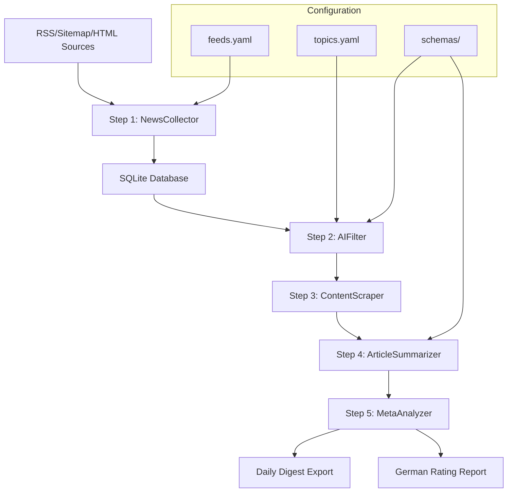

# News Analysis Pipeline Documentation

## Overview

The AI-Powered News Analysis System is a sophisticated 5-step workflow that leverages GPT models for intelligent news processing and analysis. The system is designed to efficiently collect, filter, and analyze Swiss business and financial news sources, with a focus on providing actionable insights for business intelligence.

## Pipeline Architecture



## 5-Step Workflow

### Step 1: NewsCollector - URL Collection
**Location**: `news_pipeline/collector.py`  
**Purpose**: Comprehensive Swiss news source collection via multiple channels

#### Input Sources
- **RSS Feeds**: Traditional RSS feeds from Swiss news sources
  - NZZ, Blick, Handelszeitung, Finews, Cash, FINMA, etc.
  - Configurable via `config/feeds.yaml`
- **Sitemaps**: XML sitemaps (e.g., 20min news sitemap)
- **HTML Listings**: Custom scraped content listings
- **JSON APIs**: Structured data from APIs
- **Google News**: RSS feeds (currently disabled due to redirect issues)

#### Key Features
- **Deduplication**: URL-based and title similarity detection
- **Robots.txt Compliance**: Optional respect for robots.txt
- **Error Handling**: Robust handling of malformed feeds
- **Swiss Locale Support**: Proper encoding and header handling

#### Output
- Article metadata stored in SQLite database
- Fields: URL, title, source, published_at, discovered_at

### Step 2: AIFilter - AI-Powered Filtering
**Location**: `news_pipeline/filter.py`  
**Purpose**: Single-stage pre-filter using GPT models for relevance detection

#### AI Model Integration
- **Model**: GPT-5-nano (configurable via MODEL_NANO env var)
- **Approach**: Title and URL-only classification (no content needed)
- **Schema**: Structured JSON responses using OpenAI's structured output

#### Topic Configuration
- **Active Topic**: `creditreform_insights` (B2B credit risk focus)
- **Keywords**: Bonität, Kreditrisiko, Basel III, FINMA, etc.
- **Confidence Threshold**: 0.80 (aggressive filtering)
- **Priority Sources**: Government > Financial > General news

#### Performance Optimizations
- **Smart Caching**: Skip previously processed URLs
- **Priority Scoring**: Process high-value sources first
- **Early Termination**: Stop when sufficient matches found
- **Batch Processing**: Efficient handling of large article volumes

#### Output
- Classification results with confidence scores
- Matched articles flagged for next stage
- Statistics and performance metrics

### Step 3: ContentScraper - Selective Content Scraping
**Location**: `news_pipeline/scraper.py`  
**Purpose**: Extract full article content from relevant articles only

#### Extraction Methods
1. **Trafilatura** (Primary): Fast, reliable text extraction
   - Optimized settings for Swiss news sites
   - JSON-LD fallback for structured content
   - Higher recall settings for better extraction
2. **MCP + Playwright** (Fallback): Browser-based extraction
   - Handles complex JavaScript-heavy sites
   - Cookie consent handling
   - Fresh browser sessions to avoid conflicts

#### Google News Handling
- **URL Resolution**: Decode Google News redirect URLs
- **Feature Flag**: Skip Google News by default (SKIP_GNEWS_REDIRECTS=true)
- **Comprehensive Decoder**: Multiple decoding strategies for redirects

#### Quality Control
- **Minimum Length**: 600 characters required
- **Error Handling**: Graceful fallback between methods
- **Resource Management**: Browser session cleanup

#### Output
- Extracted article text stored in database
- Extraction method tracking (trafilatura vs playwright)
- Performance statistics

### Step 4: ArticleSummarizer - Individual Article Summarization
**Location**: `news_pipeline/summarizer.py`  
**Purpose**: Generate structured summaries using GPT models

#### AI Processing
- **Model**: GPT-5-mini (configurable via MODEL_MINI env var)
- **Structured Output**: JSON schema-enforced responses
- **Swiss Business Context**: Specialized prompts for Swiss business news

#### Summary Structure
```json
{
  "title": "Enhanced article title",
  "summary": "150-200 word concise summary",
  "key_points": ["Array of 3-6 key bullet points"],
  "entities": {
    "companies": ["Company names"],
    "people": ["Person names"],
    "locations": ["Places/countries"],
    "topics": ["Key themes"]
  }
}
```

#### Focus Areas
- Swiss business context and implications
- Financial impacts and market relevance
- Key stakeholders and companies
- Strategic implications and outlook

#### Output
- Structured summaries stored in database
- Entity extraction for trend analysis
- Processing statistics and quality metrics

### Step 5: MetaAnalyzer - Meta-Summary Generation
**Location**: `news_pipeline/analyzer.py`  
**Purpose**: Aggregate intelligence and comprehensive topic analysis

#### Daily Digest Generation
- **Topic Analysis**: Generate digest for each active topic
- **Executive Summary**: Cross-topic insights and patterns
- **Trending Analysis**: Identify hot topics and emerging themes
- **Time-based Grouping**: Daily and weekly digest options

#### Output Formats
1. **JSON Export**: Structured data for programmatic access
2. **Markdown Export**: Human-readable format
3. **German Rating Report**: Auto-generated localized report

#### Digest Structure
```json
{
  "date": "2025-09-20",
  "executive_summary": {
    "headline": "Main headline for the day",
    "executive_summary": "Key insights",
    "key_themes": ["Major themes"],
    "top_priorities": ["Executive priorities"]
  },
  "topic_digests": {
    "creditreform_insights": {
      "headline": "Topic headline",
      "why_it_matters": "Business impact",
      "bullets": ["Key points"],
      "sources": ["Article URLs"],
      "article_count": 5
    }
  },
  "trending_topics": [...]
}
```

## Configuration Management

### feeds.yaml
**Purpose**: Define news sources for collection

```yaml
rss:
  nzz: ["https://www.nzz.ch/recent.rss"]
  handelszeitung: ["https://www.handelszeitung.ch/rss.xml"]

sitemaps:
  20min: ["https://www.20min.ch/sitemaps/de/news.xml"]

html:
  businessclassost:
    url: "https://example.com"
    selectors:
      item: ".article"
      title: "h2"
      date: ".date"
```

### topics.yaml
**Purpose**: Configure AI filtering topics and keywords

```yaml
topics:
  creditreform_insights:
    enabled: true
    confidence_threshold: 0.80
    max_articles_per_run: 15
    focus_areas:
      credit_risk:
        keywords: ["Bonität", "Rating", "Score"]
        priority: "high"
    include: ["List of keywords"]
    exclude_keywords: ["Irrelevant terms"]
```

## Data Flow and Storage

### SQLite Database Schema
- **items**: Raw collected articles
- **processed_links**: Caching for AI filter performance  
- **articles**: Extracted content from scraper
- **summaries**: AI-generated summaries
- **article_clusters**: Deduplication metadata

### Processing States
1. **Collected**: Article URLs stored in `items` table
2. **Filtered**: AI classification results, `is_match` flag set
3. **Scraped**: Full content extracted, stored in `articles` table
4. **Summarized**: AI summary generated, stored in `summaries` table
5. **Analyzed**: Included in meta-analysis and daily digest

## Performance and Optimization

### Key Optimizations
- **Smart Caching**: Skip previously processed URLs (90% time savings)
- **Priority Scoring**: Process high-value sources first
- **Early Termination**: Stop processing when sufficient matches found
- **Resource Management**: Fresh browser sessions, connection pooling
- **Batch Processing**: Efficient handling of large volumes

### Performance Targets
- **Express Mode**: < 3 minutes end-to-end
- **Standard Mode**: < 8 minutes end-to-end
- **Match Rate**: 15-25 relevant articles per run
- **Extraction Rate**: 70-85% successful content extraction

## Error Handling and Resilience

### Robust Error Management
- **Graceful Degradation**: Fallback methods for each component
- **Retry Logic**: Smart retry with exponential backoff
- **Resource Cleanup**: Proper browser session management
- **Comprehensive Logging**: Detailed logging for troubleshooting

### Common Issues and Solutions
- **Google News Redirects**: Disabled by default, comprehensive decoder available
- **Browser Session Conflicts**: Fresh sessions every 3 articles
- **Feed Parsing Errors**: Bozo-tolerant parsing with fallbacks
- **Rate Limiting**: Configurable delays and timeouts

## Usage Patterns

### Full Pipeline
```bash
python news_analyzer.py                    # Run complete 5-step workflow
python news_analyzer.py --limit 25         # Limit processing volume
python news_analyzer.py --format markdown  # Export as markdown
```

### Individual Steps
```bash
python news_analyzer.py --step collect     # Step 1 only
python news_analyzer.py --step filter      # Step 2 only
python news_analyzer.py --step scrape      # Step 3 only
python news_analyzer.py --step summarize   # Step 4 only
python news_analyzer.py --step digest      # Step 5 only
```

### Statistics and Monitoring
```bash
python news_analyzer.py --stats            # Show pipeline statistics
python news_analyzer.py --export           # Export digest only
```

## Development and Maintenance

### Adding New Sources
1. Add RSS/HTML configuration to `feeds.yaml`
2. Test collection with `--step collect`
3. Monitor extraction rates and adjust selectors if needed

### Modifying Topics
1. Update keyword lists in `topics.yaml`
2. Adjust confidence thresholds based on performance
3. Test with `--step filter` to validate changes

### Schema Evolution
- Update JSON schemas in `schemas/` directory
- Ensure compatibility with OpenAI structured output requirements
- Test schema validation with sample data

## Integration Points

### External Dependencies
- **OpenAI API**: GPT model access for filtering and summarization
- **MCP + Playwright**: Browser automation for complex sites
- **Trafilatura**: Primary content extraction library
- **SQLite**: Local database for data persistence

### Output Integration
- **JSON APIs**: Structured data export for downstream systems
- **Markdown Reports**: Human-readable executive briefings
- **German Localization**: Automated translation for local stakeholders

## Setup and Installation

### Prerequisites
- **Python 3.9+**: Core runtime environment
- **SQLite**: Database storage (included with Python)
- **OpenAI API Key**: Required for AI filtering and summarization
- **Node.js** (optional): For MCP server functionality

### Environment Configuration

Create `.env` file in project root:
```env
# OpenAI Configuration
OPENAI_API_KEY=your_openai_api_key_here
MODEL_NANO=gpt-4o-mini          # For filtering (fast, cost-effective)
MODEL_MINI=gpt-4o               # For summarization (higher quality)

# Database Configuration
DB_PATH=./news.db

# Request Configuration
USER_AGENT=NewsAnalyzerBot/1.0 (+contact@email)
REQUEST_TIMEOUT_SEC=12
CRAWL_DELAY_SEC=4
MAX_ITEMS_PER_FEED=120

# Performance Tuning
CONFIDENCE_THRESHOLD=0.70
SKIP_GNEWS_REDIRECTS=true

# Logging
LOG_LEVEL=INFO
```

### Installation Steps

1. **Clone Repository**
   ```bash
   git clone <repository-url>
   cd news_analysis_2.0
   ```

2. **Install Dependencies**
   ```bash
   pip install -r requirements.txt
   ```

3. **Initialize Database**
   ```bash
   python scripts/init_db.py
   ```

4. **Load Feed Configuration**
   ```bash
   python scripts/load_feeds.py
   ```

5. **Test Installation**
   ```bash
   python news_analyzer.py --stats
   ```

### Core Dependencies

```txt
# Core Processing
openai>=1.0.0                    # AI model integration
trafilatura>=1.6.0              # Content extraction
feedparser>=6.0.0               # RSS parsing
beautifulsoup4>=4.12.0          # HTML parsing
requests>=2.31.0                # HTTP client

# Database
sqlite3                          # Built-in with Python

# Browser Automation (Optional)
mcp-use                          # MCP client integration
langchain-openai                 # LangChain OpenAI integration

# Utilities
pyyaml>=6.0                      # Configuration files
python-dateutil>=2.8.0          # Date parsing
python-dotenv>=1.0.0            # Environment variables
```

### Directory Structure

```
news_analysis_2.0/
├── news_analyzer.py             # Main pipeline entry point
├── news_pipeline/               # Core pipeline modules
│   ├── __init__.py
│   ├── collector.py            # Step 1: URL Collection
│   ├── filter.py               # Step 2: AI Filtering
│   ├── scraper.py              # Step 3: Content Scraping
│   ├── summarizer.py           # Step 4: Article Summarization
│   ├── analyzer.py             # Step 5: Meta-Analysis
│   └── utils.py                # Shared utilities
├── config/                      # Configuration files
│   ├── feeds.yaml              # News source configuration
│   ├── topics.yaml             # AI topic configuration
│   └── mcp.json                # MCP server configuration
├── schemas/                     # JSON schemas
│   ├── triage.schema.json      # AI filtering schema
│   └── summary.schema.json     # Summarization schema
├── scripts/                     # Utility scripts
│   ├── init_db.py              # Database initialization
│   └── load_feeds.py           # Feed configuration loader
├── documentation/               # Documentation
│   └── pipeline_flow_documentation.md
├── out/                         # Output directory
│   └── digests/                # Generated digests
├── logs/                        # Application logs
├── rating_reports/              # German rating reports
├── .env                         # Environment variables
├── requirements.txt             # Python dependencies
└── README.md                    # Project overview
```

### Database Schema

The pipeline uses SQLite with the following key tables:

```sql
-- Raw collected articles
CREATE TABLE items (
    id INTEGER PRIMARY KEY AUTOINCREMENT,
    source TEXT NOT NULL,
    url TEXT NOT NULL,
    normalized_url TEXT,
    title TEXT,
    published_at TEXT,
    first_seen_at TEXT DEFAULT (datetime('now')),
    triage_topic TEXT,
    triage_confidence REAL,
    is_match INTEGER DEFAULT 0
);

-- AI filter caching for performance
CREATE TABLE processed_links (
    id INTEGER PRIMARY KEY AUTOINCREMENT,
    url_hash TEXT NOT NULL,
    url TEXT NOT NULL,
    topic TEXT NOT NULL,
    result TEXT NOT NULL,
    confidence REAL DEFAULT 0.0,
    created_at TEXT DEFAULT (datetime('now'))
);

-- Extracted article content
CREATE TABLE articles (
    id INTEGER PRIMARY KEY AUTOINCREMENT,
    item_id INTEGER NOT NULL,
    extracted_text TEXT NOT NULL,
    method TEXT,
    extracted_at TEXT DEFAULT (datetime('now')),
    FOREIGN KEY (item_id) REFERENCES items (id)
);

-- AI-generated summaries
CREATE TABLE summaries (
    id INTEGER PRIMARY KEY AUTOINCREMENT,
    item_id INTEGER NOT NULL,
    topic TEXT NOT NULL,
    model TEXT,
    summary TEXT NOT NULL,
    key_points_json TEXT,
    entities_json TEXT,
    created_at TEXT DEFAULT (datetime('now')),
    FOREIGN KEY (item_id) REFERENCES items (id)
);
```

### Configuration Customization

#### Adding New News Sources

1. **RSS Feeds** (Recommended)
   ```yaml
   # config/feeds.yaml
   rss:
     new_source:
       - "https://example.com/rss.xml"
       - "https://example.com/business.rss"
   ```

2. **HTML Scraping**
   ```yaml
   # config/feeds.yaml
   html:
     custom_site:
       url: "https://example.com/news"
       selectors:
         item: ".news-item"
         title: ".headline"
         date: ".publish-date"
         hidden_url: ".article-url"
   ```

#### Modifying AI Topics

```yaml
# config/topics.yaml
topics:
  your_custom_topic:
    enabled: true
    description: "Your topic description"
    confidence_threshold: 0.75
    max_articles_per_run: 20
    include: ["keyword1", "keyword2", "keyword3"]
    exclude_keywords: ["exclude1", "exclude2"]
    focus_areas:
      main_area:
        keywords: ["specific", "keywords"]
        priority: "high"
```

### Operational Procedures

#### Daily Operation
```bash
# Full pipeline execution
python news_analyzer.py

# Express mode (< 3 minutes)
python news_analyzer.py --limit 15

# Export only (skip processing)
python news_analyzer.py --export
```

#### Maintenance Tasks
```bash
# Check pipeline health
python news_analyzer.py --stats

# Test individual components
python news_analyzer.py --step collect
python news_analyzer.py --step filter

# Database maintenance
sqlite3 news.db "VACUUM;"
sqlite3 news.db "ANALYZE;"
```

#### Troubleshooting

**Common Issues:**

1. **OpenAI API Errors**
   ```bash
   # Check API key
   echo $OPENAI_API_KEY
   
   # Test API connectivity
   python -c "from openai import OpenAI; print(OpenAI().models.list())"
   ```

2. **Database Issues**
   ```bash
   # Recreate database
   rm news.db
   python scripts/init_db.py
   ```

3. **Browser Automation Failures**
   ```bash
   # Check MCP configuration
   python -c "from mcp_use import MCPClient; print('MCP OK')"
   
   # Reset browser sessions
   python news_analyzer.py --step scrape --limit 5
   ```

4. **Feed Collection Problems**
   ```bash
   # Test specific feeds
   python scripts/load_feeds.py --test
   
   # Check feed accessibility
   curl -A "NewsAnalyzerBot/1.0" "https://example.com/feed.rss"
   ```

## Monitoring and Maintenance

### Key Metrics
- **Collection Rate**: Articles collected per source
- **Match Rate**: Percentage of articles passing AI filter
- **Extraction Rate**: Successful content scraping percentage
- **Processing Time**: End-to-end pipeline duration

### Health Checks
- Database integrity and growth rates
- AI model response times and error rates
- Content extraction success rates
- Output quality and completeness

### Performance Monitoring

```bash
# Database size monitoring
ls -lh news.db

# Log analysis
tail -f logs/pipeline.log | grep ERROR

# Performance metrics
python news_analyzer.py --stats | grep "rate\|time\|count"
```

### Backup and Recovery

```bash
# Database backup
cp news.db "news_backup_$(date +%Y%m%d).db"

# Configuration backup
tar -czf "config_backup_$(date +%Y%m%d).tar.gz" config/ schemas/

# Full system backup
tar -czf "pipeline_backup_$(date +%Y%m%d).tar.gz" \
  news.db config/ schemas/ out/ logs/ .env
```

This pipeline represents a sophisticated approach to automated news analysis, combining traditional web scraping techniques with modern AI capabilities to deliver actionable business intelligence from Swiss news sources.
